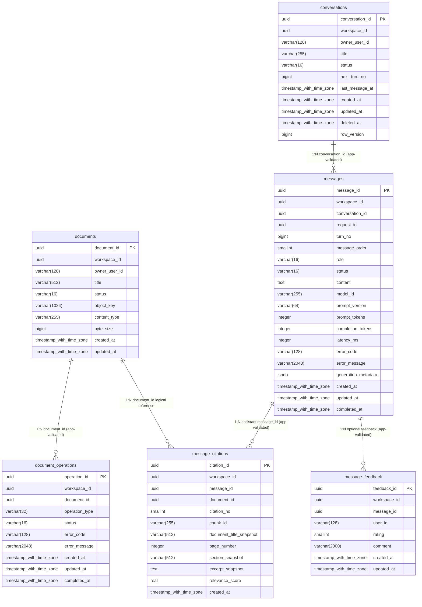

# RAG データベース定義

このファイルは `db/schema.sql` と `db/docs-metadata.json` から自動生成されています。手動編集せず、`npm run docs:db` を実行してください。

## ER 図

Aurora DSQL では外部キーを使わず、アプリケーション層のトランザクションで参照整合性を検証します。下図のリレーションは論理関係です。



## CRUD 図

| API / 処理                          | documents | document_operations | conversations | messages | message_citations | message_feedback |
| ----------------------------------- | --------- | ------------------- | ------------- | -------- | ----------------- | ---------------- |
| POST /api/chat                      | R         |                     | CU            | CRU      | C                 |                  |
| GET /api/conversations              |           |                     | R             |          |                   |                  |
| GET /api/conversations/:id/messages |           |                     | R             | R        | R                 |                  |
| DELETE /api/conversations/:id       |           |                     | U             |          |                   |                  |
| PATCH /api/conversations/:id        |           |                     | U             |          |                   |                  |
| PUT /api/messages/:id/feedback      |           |                     |               | R        |                   | CU               |
| document ingestion worker           | CRU       | CRU                 |               |          |                   |                  |
| conversation purge batch            |           |                     | D             | D        | D                 | D                |

凡例: C=Create、R=Read、U=Update、D=Delete。空欄は直接アクセスなし。

## テーブル定義

### rag.documents

| Column          | Definition                                                    |
| --------------- | ------------------------------------------------------------- |
| `document_id`   | `uuid NOT NULL`                                               |
| `workspace_id`  | `uuid NOT NULL`                                               |
| `owner_user_id` | `varchar(128) NOT NULL`                                       |
| `title`         | `varchar(512) NOT NULL`                                       |
| `status`        | `varchar(16) NOT NULL DEFAULT 'uploaded'`                     |
| `object_key`    | `varchar(1024) NOT NULL`                                      |
| `content_type`  | `varchar(255)`                                                |
| `byte_size`     | `bigint`                                                      |
| `created_at`    | `timestamp with time zone NOT NULL DEFAULT current_timestamp` |
| `updated_at`    | `timestamp with time zone NOT NULL DEFAULT current_timestamp` |

#### Constraints

- `CONSTRAINT documents_pk PRIMARY KEY (document_id)`
- `CONSTRAINT documents_status_ck CHECK (status IN ('uploaded', 'processing', 'ready', 'failed', 'deleted'))`
- `CONSTRAINT documents_byte_size_ck CHECK (byte_size IS NULL OR byte_size >= 0)`

#### Indexes

- なし

### rag.document_operations

| Column           | Definition                                                    |
| ---------------- | ------------------------------------------------------------- |
| `operation_id`   | `uuid NOT NULL`                                               |
| `workspace_id`   | `uuid NOT NULL`                                               |
| `document_id`    | `uuid NOT NULL`                                               |
| `operation_type` | `varchar(32) NOT NULL`                                        |
| `status`         | `varchar(16) NOT NULL`                                        |
| `error_code`     | `varchar(128)`                                                |
| `error_message`  | `varchar(2048)`                                               |
| `created_at`     | `timestamp with time zone NOT NULL DEFAULT current_timestamp` |
| `updated_at`     | `timestamp with time zone NOT NULL DEFAULT current_timestamp` |
| `completed_at`   | `timestamp with time zone`                                    |

#### Constraints

- `CONSTRAINT document_operations_pk PRIMARY KEY (operation_id)`
- `CONSTRAINT document_operations_type_ck CHECK (operation_type IN ('upload', 'extract', 'embed', 'delete'))`
- `CONSTRAINT document_operations_status_ck CHECK (status IN ('queued', 'running', 'completed', 'failed', 'cancelled'))`

#### Indexes

- `idx_document_operations_document`: `workspace_id, document_id, created_at, operation_id`

### rag.conversations

| Column            | Definition                                                    |
| ----------------- | ------------------------------------------------------------- |
| `conversation_id` | `uuid NOT NULL`                                               |
| `workspace_id`    | `uuid NOT NULL`                                               |
| `owner_user_id`   | `varchar(128) NOT NULL`                                       |
| `title`           | `varchar(255)`                                                |
| `status`          | `varchar(16) NOT NULL DEFAULT 'active'`                       |
| `next_turn_no`    | `bigint NOT NULL DEFAULT 1`                                   |
| `last_message_at` | `timestamp with time zone NOT NULL DEFAULT current_timestamp` |
| `created_at`      | `timestamp with time zone NOT NULL DEFAULT current_timestamp` |
| `updated_at`      | `timestamp with time zone NOT NULL DEFAULT current_timestamp` |
| `deleted_at`      | `timestamp with time zone`                                    |
| `row_version`     | `bigint NOT NULL DEFAULT 0`                                   |

#### Constraints

- `CONSTRAINT conversations_pk PRIMARY KEY (conversation_id)`
- `CONSTRAINT conversations_status_ck CHECK (status IN ('active', 'archived', 'deleted'))`
- `CONSTRAINT conversations_turn_ck CHECK (next_turn_no > 0)`

#### Indexes

- `idx_conversations_owner_recent`: `workspace_id, owner_user_id, last_message_at, conversation_id`

### rag.messages

| Column                | Definition                                                    |
| --------------------- | ------------------------------------------------------------- |
| `message_id`          | `uuid NOT NULL`                                               |
| `workspace_id`        | `uuid NOT NULL`                                               |
| `conversation_id`     | `uuid NOT NULL`                                               |
| `request_id`          | `uuid NOT NULL`                                               |
| `turn_no`             | `bigint NOT NULL`                                             |
| `message_order`       | `smallint NOT NULL`                                           |
| `role`                | `varchar(16) NOT NULL`                                        |
| `status`              | `varchar(16) NOT NULL`                                        |
| `content`             | `text NOT NULL DEFAULT ''`                                    |
| `model_id`            | `varchar(255)`                                                |
| `prompt_version`      | `varchar(64)`                                                 |
| `prompt_tokens`       | `integer`                                                     |
| `completion_tokens`   | `integer`                                                     |
| `latency_ms`          | `integer`                                                     |
| `error_code`          | `varchar(128)`                                                |
| `error_message`       | `varchar(2048)`                                               |
| `generation_metadata` | `jsonb`                                                       |
| `created_at`          | `timestamp with time zone NOT NULL DEFAULT current_timestamp` |
| `updated_at`          | `timestamp with time zone NOT NULL DEFAULT current_timestamp` |
| `completed_at`        | `timestamp with time zone`                                    |

#### Constraints

- `CONSTRAINT messages_pk PRIMARY KEY (message_id)`
- `CONSTRAINT messages_turn_order_uq UNIQUE (conversation_id, turn_no, message_order)`
- `CONSTRAINT messages_request_order_uq UNIQUE (workspace_id, request_id, message_order)`
- `CONSTRAINT messages_role_ck CHECK (role IN ('user', 'assistant'))`
- `CONSTRAINT messages_order_ck CHECK ((role = 'user' AND message_order = 0) OR (role = 'assistant' AND message_order = 1))`
- `CONSTRAINT messages_status_ck CHECK (status IN ('generating', 'completed', 'failed', 'cancelled'))`
- `CONSTRAINT messages_turn_ck CHECK (turn_no > 0)`
- `CONSTRAINT messages_tokens_ck CHECK ((prompt_tokens IS NULL OR prompt_tokens >= 0) AND (completion_tokens IS NULL OR completion_tokens >= 0) AND (latency_ms IS NULL OR latency_ms >= 0))`

#### Indexes

- `idx_messages_conversation_turn`: `workspace_id, conversation_id, turn_no, message_order, message_id`
- `idx_messages_status_updated`: `status, updated_at, message_id`

### rag.message_citations

| Column                    | Definition                                                    |
| ------------------------- | ------------------------------------------------------------- |
| `citation_id`             | `uuid NOT NULL`                                               |
| `workspace_id`            | `uuid NOT NULL`                                               |
| `message_id`              | `uuid NOT NULL`                                               |
| `document_id`             | `uuid NOT NULL`                                               |
| `citation_no`             | `smallint NOT NULL`                                           |
| `chunk_id`                | `varchar(255)`                                                |
| `document_title_snapshot` | `varchar(512) NOT NULL`                                       |
| `page_number`             | `integer`                                                     |
| `section_snapshot`        | `varchar(512)`                                                |
| `excerpt_snapshot`        | `text NOT NULL`                                               |
| `relevance_score`         | `real`                                                        |
| `created_at`              | `timestamp with time zone NOT NULL DEFAULT current_timestamp` |

#### Constraints

- `CONSTRAINT message_citations_pk PRIMARY KEY (citation_id)`
- `CONSTRAINT message_citations_order_uq UNIQUE (message_id, citation_no)`
- `CONSTRAINT message_citations_no_ck CHECK (citation_no > 0)`
- `CONSTRAINT message_citations_page_ck CHECK (page_number IS NULL OR page_number > 0)`

#### Indexes

- `idx_message_citations_message`: `workspace_id, message_id, citation_no, citation_id`

### rag.message_feedback

| Column         | Definition                                                    |
| -------------- | ------------------------------------------------------------- |
| `feedback_id`  | `uuid NOT NULL`                                               |
| `workspace_id` | `uuid NOT NULL`                                               |
| `message_id`   | `uuid NOT NULL`                                               |
| `user_id`      | `varchar(128) NOT NULL`                                       |
| `rating`       | `smallint NOT NULL`                                           |
| `comment`      | `varchar(2000)`                                               |
| `created_at`   | `timestamp with time zone NOT NULL DEFAULT current_timestamp` |
| `updated_at`   | `timestamp with time zone NOT NULL DEFAULT current_timestamp` |

#### Constraints

- `CONSTRAINT message_feedback_pk PRIMARY KEY (feedback_id)`
- `CONSTRAINT message_feedback_message_user_uq UNIQUE (message_id, user_id)`
- `CONSTRAINT message_feedback_rating_ck CHECK (rating IN (-1, 1))`

#### Indexes

- なし

## DDL

```sql
CREATE SCHEMA IF NOT EXISTS rag;

CREATE TABLE rag.documents (
    document_id uuid NOT NULL,
    workspace_id uuid NOT NULL,
    owner_user_id varchar(128) NOT NULL,
    title varchar(512) NOT NULL,
    status varchar(16) NOT NULL DEFAULT 'uploaded',
    object_key varchar(1024) NOT NULL,
    content_type varchar(255),
    byte_size bigint,
    created_at timestamp with time zone NOT NULL DEFAULT current_timestamp,
    updated_at timestamp with time zone NOT NULL DEFAULT current_timestamp,

    CONSTRAINT documents_pk PRIMARY KEY (document_id),
    CONSTRAINT documents_status_ck CHECK (status IN ('uploaded', 'processing', 'ready', 'failed', 'deleted')),
    CONSTRAINT documents_byte_size_ck CHECK (byte_size IS NULL OR byte_size >= 0)
);

CREATE TABLE rag.document_operations (
    operation_id uuid NOT NULL,
    workspace_id uuid NOT NULL,
    document_id uuid NOT NULL,
    operation_type varchar(32) NOT NULL,
    status varchar(16) NOT NULL,
    error_code varchar(128),
    error_message varchar(2048),
    created_at timestamp with time zone NOT NULL DEFAULT current_timestamp,
    updated_at timestamp with time zone NOT NULL DEFAULT current_timestamp,
    completed_at timestamp with time zone,

    CONSTRAINT document_operations_pk PRIMARY KEY (operation_id),
    CONSTRAINT document_operations_type_ck CHECK (operation_type IN ('upload', 'extract', 'embed', 'delete')),
    CONSTRAINT document_operations_status_ck CHECK (status IN ('queued', 'running', 'completed', 'failed', 'cancelled'))
);

CREATE TABLE rag.conversations (
    conversation_id uuid NOT NULL,
    workspace_id uuid NOT NULL,
    owner_user_id varchar(128) NOT NULL,
    title varchar(255),
    status varchar(16) NOT NULL DEFAULT 'active',
    next_turn_no bigint NOT NULL DEFAULT 1,
    last_message_at timestamp with time zone NOT NULL DEFAULT current_timestamp,
    created_at timestamp with time zone NOT NULL DEFAULT current_timestamp,
    updated_at timestamp with time zone NOT NULL DEFAULT current_timestamp,
    deleted_at timestamp with time zone,
    row_version bigint NOT NULL DEFAULT 0,

    CONSTRAINT conversations_pk PRIMARY KEY (conversation_id),
    CONSTRAINT conversations_status_ck CHECK (status IN ('active', 'archived', 'deleted')),
    CONSTRAINT conversations_turn_ck CHECK (next_turn_no > 0)
);

CREATE TABLE rag.messages (
    message_id uuid NOT NULL,
    workspace_id uuid NOT NULL,
    conversation_id uuid NOT NULL,
    request_id uuid NOT NULL,
    turn_no bigint NOT NULL,
    message_order smallint NOT NULL,
    role varchar(16) NOT NULL,
    status varchar(16) NOT NULL,
    content text NOT NULL DEFAULT '',
    model_id varchar(255),
    prompt_version varchar(64),
    prompt_tokens integer,
    completion_tokens integer,
    latency_ms integer,
    error_code varchar(128),
    error_message varchar(2048),
    generation_metadata jsonb,
    created_at timestamp with time zone NOT NULL DEFAULT current_timestamp,
    updated_at timestamp with time zone NOT NULL DEFAULT current_timestamp,
    completed_at timestamp with time zone,

    CONSTRAINT messages_pk PRIMARY KEY (message_id),
    CONSTRAINT messages_turn_order_uq UNIQUE (conversation_id, turn_no, message_order),
    CONSTRAINT messages_request_order_uq UNIQUE (workspace_id, request_id, message_order),
    CONSTRAINT messages_role_ck CHECK (role IN ('user', 'assistant')),
    CONSTRAINT messages_order_ck CHECK ((role = 'user' AND message_order = 0) OR (role = 'assistant' AND message_order = 1)),
    CONSTRAINT messages_status_ck CHECK (status IN ('generating', 'completed', 'failed', 'cancelled')),
    CONSTRAINT messages_turn_ck CHECK (turn_no > 0),
    CONSTRAINT messages_tokens_ck CHECK ((prompt_tokens IS NULL OR prompt_tokens >= 0) AND (completion_tokens IS NULL OR completion_tokens >= 0) AND (latency_ms IS NULL OR latency_ms >= 0))
);

CREATE TABLE rag.message_citations (
    citation_id uuid NOT NULL,
    workspace_id uuid NOT NULL,
    message_id uuid NOT NULL,
    document_id uuid NOT NULL,
    citation_no smallint NOT NULL,
    chunk_id varchar(255),
    document_title_snapshot varchar(512) NOT NULL,
    page_number integer,
    section_snapshot varchar(512),
    excerpt_snapshot text NOT NULL,
    relevance_score real,
    created_at timestamp with time zone NOT NULL DEFAULT current_timestamp,

    CONSTRAINT message_citations_pk PRIMARY KEY (citation_id),
    CONSTRAINT message_citations_order_uq UNIQUE (message_id, citation_no),
    CONSTRAINT message_citations_no_ck CHECK (citation_no > 0),
    CONSTRAINT message_citations_page_ck CHECK (page_number IS NULL OR page_number > 0)
);

CREATE TABLE rag.message_feedback (
    feedback_id uuid NOT NULL,
    workspace_id uuid NOT NULL,
    message_id uuid NOT NULL,
    user_id varchar(128) NOT NULL,
    rating smallint NOT NULL,
    comment varchar(2000),
    created_at timestamp with time zone NOT NULL DEFAULT current_timestamp,
    updated_at timestamp with time zone NOT NULL DEFAULT current_timestamp,

    CONSTRAINT message_feedback_pk PRIMARY KEY (feedback_id),
    CONSTRAINT message_feedback_message_user_uq UNIQUE (message_id, user_id),
    CONSTRAINT message_feedback_rating_ck CHECK (rating IN (-1, 1))
);

CREATE INDEX ASYNC idx_conversations_owner_recent
ON rag.conversations (workspace_id, owner_user_id, last_message_at, conversation_id);

CREATE INDEX ASYNC idx_messages_conversation_turn
ON rag.messages (workspace_id, conversation_id, turn_no, message_order, message_id);

CREATE INDEX ASYNC idx_messages_status_updated
ON rag.messages (status, updated_at, message_id);

CREATE INDEX ASYNC idx_message_citations_message
ON rag.message_citations (workspace_id, message_id, citation_no, citation_id);

CREATE INDEX ASYNC idx_document_operations_document
ON rag.document_operations (workspace_id, document_id, created_at, operation_id);
```
