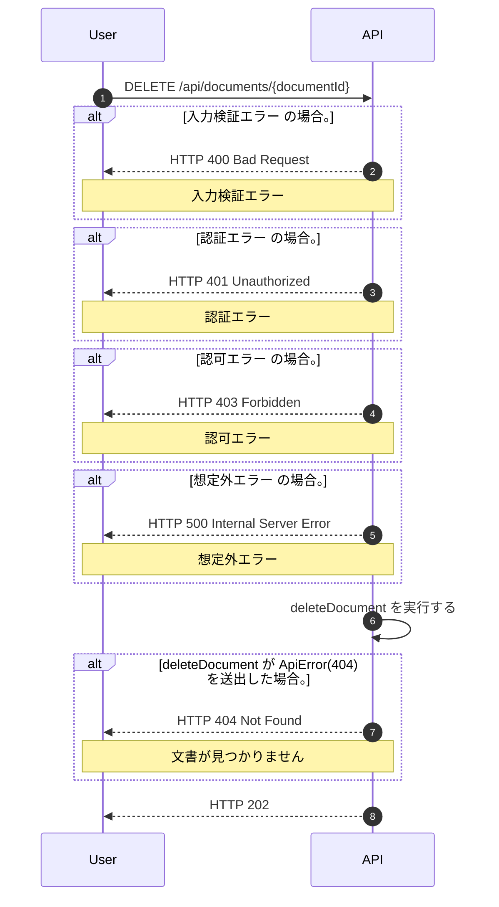

<!-- 自動生成・直接編集禁止: npm run docs:generate --workspace @saphnexa/api で更新 -->

# delete sequence

```mermaid
sequenceDiagram
  autonumber
  participant User as User
  participant API as API
  User->>API: DELETE /api/documents/{documentId}
  alt 入力検証エラー の場合。
  API-->>User: HTTP 400 Bad Request
  Note over User,API: 入力検証エラー
  end
  alt 認証エラー の場合。
  API-->>User: HTTP 401 Unauthorized
  Note over User,API: 認証エラー
  end
  alt 認可エラー の場合。
  API-->>User: HTTP 403 Forbidden
  Note over User,API: 認可エラー
  end
  alt 想定外エラー の場合。
  API-->>User: HTTP 500 Internal Server Error
  Note over User,API: 想定外エラー
  end
  API->>API: deleteDocument を実行する
  alt deleteDocument が ApiError(404) を送出した場合。
  API-->>User: HTTP 404 Not Found
  Note over User,API: 文書が見つかりません
  end
  API-->>User: HTTP 202
```
