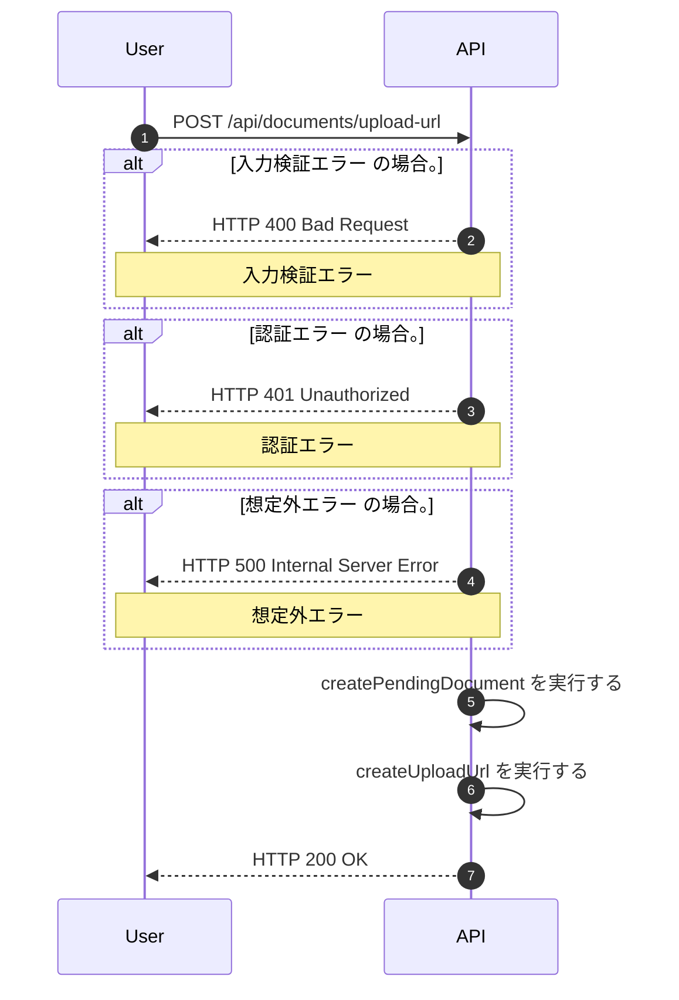

<!-- 自動生成・直接編集禁止: npm run docs:generate --workspace @saphnexa/api で更新 -->

# upload-url sequence

```mermaid
sequenceDiagram
  autonumber
  participant User as User
  participant API as API
  User->>API: POST /api/documents/upload-url
  alt 入力検証エラー の場合。
  API-->>User: HTTP 400 Bad Request
  Note over User,API: 入力検証エラー
  end
  alt 認証エラー の場合。
  API-->>User: HTTP 401 Unauthorized
  Note over User,API: 認証エラー
  end
  alt 想定外エラー の場合。
  API-->>User: HTTP 500 Internal Server Error
  Note over User,API: 想定外エラー
  end
  API->>API: createPendingDocument を実行する
  API->>API: createUploadUrl を実行する
  API-->>User: HTTP 200 OK
```
