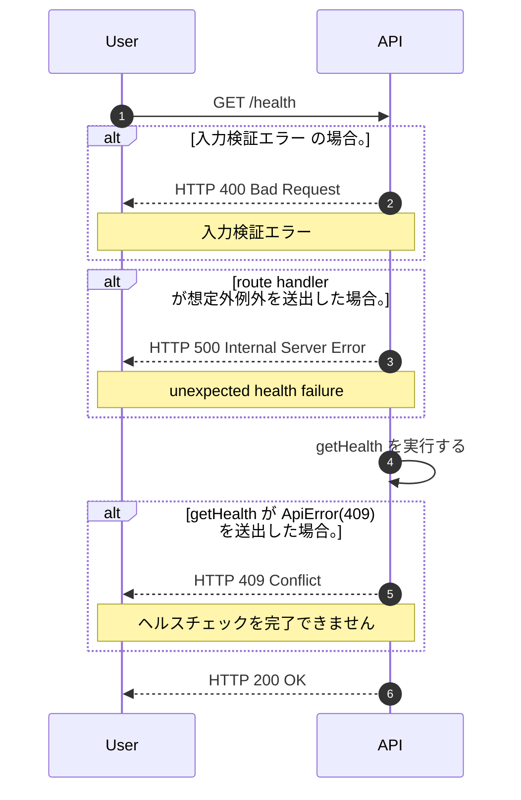

<!-- 自動生成・直接編集禁止: npm run docs:generate --workspace @saphnexa/api で更新 -->

# health sequence

```mermaid
sequenceDiagram
  autonumber
  participant User as User
  participant API as API
  User->>API: GET /health
  alt 入力検証エラー の場合。
  API-->>User: HTTP 400 Bad Request
  Note over User,API: 入力検証エラー
  end
  alt route handler が想定外例外を送出した場合。
  API-->>User: HTTP 500 Internal Server Error
  Note over User,API: unexpected health failure
  end
  API->>API: getHealth を実行する
  alt getHealth が ApiError(409) を送出した場合。
  API-->>User: HTTP 409 Conflict
  Note over User,API: ヘルスチェックを完了できません
  end
  API-->>User: HTTP 200 OK
```
